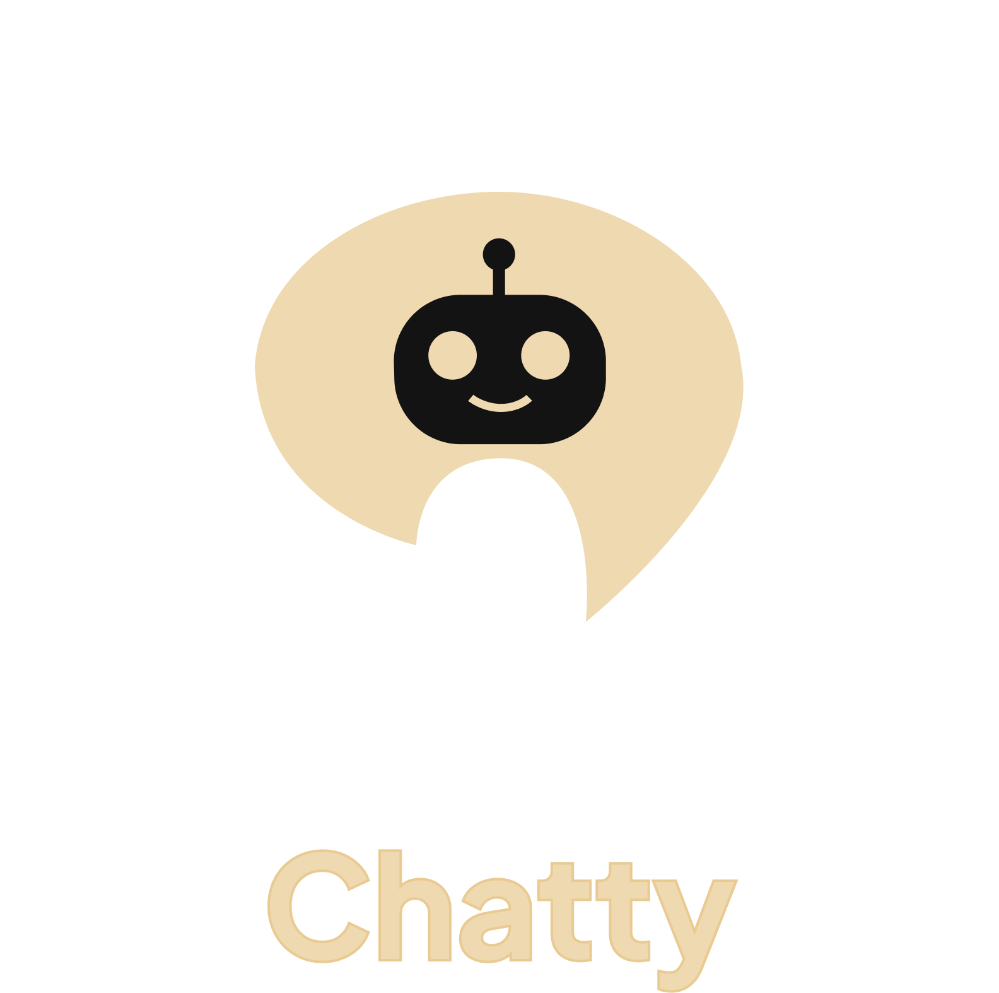

<div align="center">


</div>

## About the project

<div align = "center">
**Chatty** is a sophisticated, clean-architecture Flutter-based AI chatbot designed to be a versatile and powerful conversational AI interface. 
<br>
It allows developers to connect to any model's API, making it a flexible foundation for various AI-driven applications. 
<br> 
The project is built with a strong emphasis on testability, scalability, and maintainability by adhering to Clean Architecture principles. 
<br> 
</div>

<div align="center">


</div>


---

## Table of Contents

- [Key Features](#-key-features)
- [Project Structure](#-project-structure)
- [Code Samples](#-code-samples)
- [Built With](#️-built-with)
- [Getting Started](#-getting-started)
- [Testing](#-testing)
- [Contributing](#-contributing)
- [License](#-license)
- [Acknowledgments](#-acknowledgments)

---

## Key Features

- **AI-Powered Conversations**: Leverages the **Google Gemini AI** for intelligent, context-aware responses.
- **Voice-to-Text**: Integrates the `speech_to_text` package to capture the user's voice and convert it to text, enabling hands-free input.
- **Real-time Streaming**: Utilizes **Server-Sent Events (SSE)** to stream responses from the Gemini API, providing a dynamic and interactive user experience as the AI types.
- **Message Editing**: Allows users to long-press their own messages to edit and resend them, triggering a new AI response.
- **Retry Mechanism**: A one-tap retry button appears for any failed AI responses, providing resilience against network errors.
- **Chat History**: Persists chat sessions using **Hive**, a fast and lightweight key-value database, for local storage on the device.
-  **Modern UI**: A sleek, dark-themed interface built with Material You principles.
-  **Clean Architecture**: A robust and maintainable codebase with a clear separation of concerns.
-  **Advanced State Management**: Employs the **BLoC pattern** for predictable and scalable state handling.

---

## Project Structure

```
ai_chat_bot/
├── android/                 # Android platform files
├── assets/                 # Images and assets
├── ios/                     # iOS platform files
├── lib/
│   ├── core/               # Core functionality
│   ├── data/               # Data layer
│   ├── domain/             # Business logic
│   └── presentation/       # UI layer
├── test/                   # Unit tests
├── .env                    # Environment variables
├── pubspec.yaml           # Dependencies
└── README.md              # Introduction
```


### Presentation Layer
- **Responsibility**: Handles all UI and user interaction logic.
- **Components**:
    - **Widgets/Pages**: Flutter widgets that form the screens of the app. They are responsible for rendering the UI based on the current state.
    - **BLoC (Business Logic Component)**: Manages the state of a feature. It listens to events from the UI (e.g., button clicks) and emits new states in response. It communicates with the Domain layer via Use Cases.

### Domain Layer
- **Responsibility**: Contains the core business logic of the application. This layer is completely independent of the UI and data sources.
- **Components**:
    - **Entities**: Business objects that represent the core data structures of the app (e.g., `ChatMessageEntity`).
    - **Repositories (Abstract)**: Defines the contracts (interfaces) for the Data layer to implement. This decouples the domain logic from the specific data source implementations.
    - **Use Cases**: Encapsulates a single, specific business rule. They orchestrate the flow of data between the Presentation and Data layers by using repository contracts.

### Data Layer
- **Responsibility**: Responsible for retrieving data from various sources (e.g., remote API, local database).
- **Components**:
    - **Models**: Data Transfer Objects (DTOs) that are specific to a data source (e.g., `GeminiTextResponse` for the Gemini API). They include logic for serialization/deserialization (`fromJson`/`toJson`).
    - **Data Sources**: The concrete implementation for fetching data (e.g., `GeminiRemoteDataSource`, `HiveStorageLocalDataSource`).
    - **Repositories (Implementation)**: Implements the repository contracts defined in the Domain layer. It decides where to fetch the data from (e.g., remote or local cache).


---

## Code Samples

### 1. Waveform Visualization with CustomPainter

This project features a real-time audio waveform visualization that provides users with visual feedback during voice input. This is achieved using a `CustomPainter`, which is a low-level drawing API in Flutter that offers high performance. The `AudioWaveformPainter` animates based on the microphone's sound level.

```dart
// lib/presentation/widgets/audio_waveform_painter.dart

class AudioWaveformPainter extends CustomPainter {
  final double soundLevel;
  final double animationValue;
  final Color waveformColor;
  // ... other properties

  const AudioWaveformPainter({
    required this.soundLevel,
    required this.animationValue,
    required this.waveformColor,
    // ...
  });

  @override
  void paint(Canvas canvas, Size size) {
    final paint = Paint()
      ..color = waveformColor
      ..strokeWidth = 2.5
      ..strokeCap = StrokeCap.round;

    const barCount = 25;
    final barWidth = (size.width - 32) / barCount;

    for (int i = 0; i < barCount; i++) {
      // Create an animated sine wave effect
      final wavePhase = (animationValue * 4 * math.pi) + (i * 0.5);
      final baseHeight = math.sin(wavePhase) * 8 + 12;

      // Amplify the wave based on the actual sound level from the microphone
      final normalizedSoundLevel = soundLevel.clamp(0.0, 1.0);
      final soundMultiplier = isListening ? (0.5 + normalizedSoundLevel * 1.5) : 0.3;

      final barHeight = (baseHeight * soundMultiplier).clamp(4.0, size.height * 0.7);

      // Draw the animated bar
      final x = 16.0 + (i * barWidth) + (barWidth / 2);
      canvas.drawLine(
        Offset(x, size.height / 2 - barHeight / 2),
        Offset(x, size.height / 2 + barHeight / 2),
        paint,
      );
    }
  }

  @override
  bool shouldRepaint(covariant CustomPainter oldDelegate) => true;
}

### 2. Custom Cupertino-Style Dropdown Menu

To enhance the user experience, the application features a custom-built, animated dropdown menu that appears when a user long-presses a message. This widget is a great example of advanced UI/UX implementation in Flutter.

#### Blurred Background and Overlay

When the menu is shown, it's presented in a new `OverlayEntry`. A `BackdropFilter` with `ImageFilter.blur` is used to create a beautiful, blurred effect over the rest of the UI, drawing the user's focus to the menu.

```dart
// lib/presentation/pages/chat/widget/cupertino_message_dropdown.dart

@override
Widget build(BuildContext context) {
  return Stack(
    children: [
      // Blurred background
      GestureDetector(
        onTap: widget.onDismiss,
        child: BackdropFilter(
          filter: ImageFilter.blur(sigmaX: 5.0, sigmaY: 5.0),
          child: Container(
            color: Colors.black.withOpacity(0.3),
          ),
        ),
      ),
      // Positioned content
      // ...
    ],
  );
}
```

#### Dynamic Positioning Logic

The dropdown's position is not static. It is dynamically calculated to appear either above or below the selected message, depending on the available space in the viewport. This ensures the menu is always fully visible.

```dart
// lib/presentation/pages/chat/widget/cupertino_message_dropdown.dart

void _calculatePosition() {
  final messageSize = widget.messageSize;
  final screenSize = MediaQuery.of(context).size;

  // Calculate available space above and below the message
  final availableSpaceBelow = screenSize.height - widget.messagePosition.dy - messageSize.height;
  final availableSpaceAbove = widget.messagePosition.dy;

  // Decide where to show the dropdown
  if (availableSpaceBelow >= _dropdownSize.height) {
    // Show below
    _dropdownPosition = Offset(widget.messagePosition.dx, widget.messagePosition.dy + messageSize.height + 8);
  } else if (availableSpaceAbove >= _dropdownSize.height) {
    // Show above
    _dropdownPosition = Offset(widget.messagePosition.dx, widget.messagePosition.dy - _dropdownSize.height - 8);
  } else {
    // Default to below if space is limited
    _dropdownPosition = Offset(widget.messagePosition.dx, widget.messagePosition.dy + messageSize.height + 8);
  }
  // ... horizontal boundary checks
}
```

#### Highlighted Message Style on Selection

When a message is long-pressed, its appearance changes to indicate that it is selected. The original widget is faded out, and a new, highlighted version is rendered in the overlay with a border and a subtle shadow.

```dart
// lib/presentation/pages/chat/widget/chat_message_widget.dart

class _MessageBubble extends StatelessWidget {
  // ...
  final bool isHighlighted;

  @override
  Widget build(BuildContext context) {
    return AnimatedContainer(
      duration: const Duration(milliseconds: 200),
      decoration: BoxDecoration(
        // ... other decorations
        border: isHighlighted
            ? Border.all(
                color: Theme.of(context).extension<CustomColors>()!.primaryDim,
                width: 2,
              )
            : null,
        boxShadow: isHighlighted
            ? [
                BoxShadow(
                  color: Theme.of(context).extension<CustomColors>()!.primaryMuted,
                  blurRadius: 8,
                ),
              ]
            : null,
      ),
      // ... child
    );
  }
}
```


```

### 3. End-to-End Streaming Data Flow

The application streams responses from the AI model in real-time. This is accomplished by handling Server-Sent Events (SSE) across all three layers of the Clean Architecture.

#### Data Layer: Parsing Raw SSE Stream

The `ImplGeminiRemoteDataSource` is responsible for making the HTTP request and parsing the raw SSE response. It decodes the UTF-8 chunks, identifies the `data:` lines, and deserializes the JSON into a strongly-typed `GeminiTextResponse` model.

```dart
// lib/data/datasources/remote/gemini/impl_gemini_remote_datasource.dart

Stream<GeminiTextResponse?> _processStreamResponse(
  http.StreamedResponse response,
  http.Client client,
) async* {
  String buffer = '';
  
  try {
    await for (final chunk in response.stream.transform(utf8.decoder)) {
      buffer += chunk;
      final lines = buffer.split('\n');
      buffer = lines.removeLast(); // Keep incomplete line in buffer
      
      for (final line in lines) {
        if (line.startsWith('data: ')) {
          final data = line.substring(6).trim();
          if (data == '[DONE]') {
            yield GeminiTextResponse.completed();
            return;
          }
          final jsonData = jsonDecode(data) as Map<String, dynamic>;
          // Convert raw JSON to a typed data model
          yield GeminiTextResponse.fromJson(jsonData);
        }
      }
    }
  } finally {
    client.close();
  }
}
```

#### Domain Layer: Abstracting the Data Flow

The `GenerateTextWithMemoryContextUseCase` abstracts the data source. Its role is to call the repository and pass the resulting stream of `LlmTextResponseEntity` objects to the Presentation layer, completely hiding the implementation details of the data source.

```dart
// lib/domain/usecases/generate_text_with_memory_context_usecase.dart

class GenerateTextWithMemoryContextUseCase {
  final ChatRepository _chatRepository;
  // ...

  Stream<LlmTextResponseEntity?> call(String prompt, List<ChatMessageEntity> context) {
    // ... logic to prepare context
    return _chatRepository.generateText(prompt, fullContext);
  }
}
```

#### Presentation Layer: Consuming the Stream in BLoC

Finally, the `ChatBloc` listens to the stream provided by the use case. With each `LlmTextResponseEntity` that arrives, it updates its state. This triggers a UI rebuild, creating the real-time "typing" effect for the user.

```dart
// lib/presentation/bloc/chat/chat_bloc.dart

Future<void> _onGenerateText(GenerateTextEvent event, Emitter<ChatState> emit) async {
  // ...
  final stream = _generateTextWithMemoryContextUseCase.call(
    event.prompt,
    state.contextMessages,
  );

  await for (final response in stream) {
    if (response != null) {
      final isCompleted = response.isComplete;
      final generatedText = response.output;

      if (generatedText != null) {
        // Append the new text chunk to the existing partial response
        final newPartialResponse = (state.partialResponse ?? '') + generatedText;

        // Find the bot message and update its text
        final messages = List<types.Message>.from(state.messages);
        final botMessageIndex = messages.indexWhere((m) => m.author.id == 'bot' && (m as types.TextMessage).status == types.Status.sending);
        
        if (botMessageIndex != -1) {
          messages[botMessageIndex] = (messages[botMessageIndex] as types.TextMessage).copyWith(
            text: newPartialResponse,
          );
        }
        
        emit(state.copyWith(
          messages: messages,
          partialResponse: newPartialResponse,
          isLoading: !isCompleted,
        ));
      }
    }
  }
}
```
## Built With

- **Framework**: **[Flutter](https://flutter.dev)**
- **Language**: **[Dart](https://dart.dev)**
- **Architecture**: **[Clean Architecture](https://blog.cleancoder.com/uncle-bob/2012/08/13/the-clean-architecture.html)**
- **State Management**: **[Flutter BLoC](https://bloclibrary.dev)**
- **Dependency Injection**: **[Get It](https://pub.dev/packages/get_it)**
- **Navigation**: **[Auto Route](https://pub.dev/packages/auto_route)**
- **Local Storage**: **[Hive](https://pub.dev/packages/hive_ce)**
- **API Communication**: **[HTTP](https://pub.dev/packages/http)** (with SSE)
- **AI Integration**: **[Google Gemini AI](https://deepmind.google/technologies/gemini/)**
- **Voice Recognition**: **[Speech to Text](https://pub.dev/packages/speech_to_text)**
- **Code Generation**: **[Build Runner](https://pub.dev/packages/build_runner)**

## Getting Started

### Prerequisites

Before running this project, make sure you have:

- **Flutter SDK** (3.7.2 or higher)
- **Dart SDK** (included with Flutter)
- **Android Studio** / **Xcode** (for mobile development)
- **Google Gemini API Key** (get one from [Google AI Studio](https://makersuite.google.com/app/apikey))

### Installation

1. **Clone the repository**
   ```bash
   git clone https://github.com/yourusername/ai_chat_bot.git
   cd ai_chat_bot
   ```

2. **Install dependencies**
   ```bash
   flutter pub get
   ```

3. **Set up environment variables**
   
   Create a `.env` file in the root directory and adjust with your API KEY:
   ```env
   GEMINI_API_KEY=your_google_gemini_api_key_here
   MODEL_NAME=gemini-2.0-flash
   ```

4. **Generate code (for auto_route and hive)**
   ```bash
   dart run build_runner build
   ```

5. **Run the application**
   ```bash
   flutter run
   ```

### Platform Setup

#### Android
- Minimum SDK: 16
- Target SDK: Latest
- Permissions: Internet, Microphone

#### iOS
- iOS 11.0+
- Permissions: Microphone usage

## Usage

1. **Start a Conversation**: Tap the input field and type your message
2. **Voice Input**: Tap the microphone icon to speak your message
3. **Edit Messages**: Long press on your messages to edit and resend
4. **Retry Failed Messages**: Tap retry button on failed AI responses
5. **View History**: Navigate to history to see past conversations

## Testing

The project maintains a high level of code quality with a comprehensive suite of unit tests. We leverage the following packages to ensure our logic is robust and predictable:

- **[Mocktail](https://pub.dev/packages/mocktail)**: For creating mock implementations of dependencies (Use Cases, Repositories), allowing us to isolate the code being tested.
- **[bloc_test](https://pub.dev/packages/bloc_test)**: A powerful utility for testing BLoCs, which simplifies the process of dispatching events and asserting state changes.

### BLoC Unit Test Example

Below is a unit test for the `ChatBloc` that verifies the message editing functionality. This test demonstrates how we:
1.  **Arrange**: Set up mock dependencies and seed the BLoC with a predefined state.
2.  **Act**: Dispatch the `EditAndResendMessageEvent` to the BLoC.
3.  **Assert**: Verify that the BLoC emits the correct sequence of states and that the appropriate use case is called with the correct parameters.

```dart
// test/presentation/bloc/chat/chat_bloc_test.dart

group('EditAndResendMessageEvent', () {
  const messageId = 'test-message-id';
  const newMessageText = 'Edited message';

  blocTest<ChatBloc, ChatState>(
    'should edit message, prune history, and regenerate response',
    build: () {
      // Arrange: Mock the AI use case to return a predictable stream
      when(() => mockGenerateTextWithMemoryContextUseCase.call(any(), any()))
          .thenAnswer((_) => Stream.value(mockLLMResponse));
      return chatBloc;
    },
    // Arrange: Seed the BLoC with an initial conversation state
    seed: () => ChatState(
      isLoading: false,
      messages: [
        types.TextMessage(
          author: const types.User(id: 'bot'),
          id: 'bot-response',
          text: 'Previous bot response',
        ),
        types.TextMessage(
          author: const types.User(id: 'user'),
          id: messageId,
          text: 'Original message',
        ),
      ],
      contextMessages: [
        ChatMessageEntity(
          id: messageId,
          content: 'Original message',
          isUser: true,
          timestamp: DateTime.now(),
          sessionId: 'test-session',
        ),
      ],
    ),
    // Act: Dispatch the event to the BLoC
    act: (bloc) => bloc.add(EditAndResendMessageEvent(messageId, newMessageText)),
    // Assert: Check that the correct use case was called
    verify: (_) {
      verify(() => mockGenerateTextWithMemoryContextUseCase.call(newMessageText, any())).called(1);
    },
  );
});
```

Run the test suite:

```bash
# Run all tests
flutter test

# Run tests with coverage
flutter test --coverage
```

## Contributing

1. Fork the project
2. Create your feature branch (`git checkout -b feature/AmazingFeature`)
3. Commit your changes (`git commit -m 'Add some AmazingFeature'`)
4. Push to the branch (`git push origin feature/AmazingFeature`)
5. Open a Pull Request

## 📄 License

This project is licensed under the MIT License - see the [LICENSE.md](LICENSE.md) file for details.

## Acknowledgments

- [Google Gemini AI](https://deepmind.google/technologies/gemini/) for the AI capabilities
- [Flutter Team](https://flutter.dev) for the amazing framework
- [BLoC Library](https://bloclibrary.dev) for excellent state management

---

<div align="center">

Developed by [TBR Group](https://github.com/TBR-Group-software).

[Back to top](#-ai-chat-bot)

</div>
